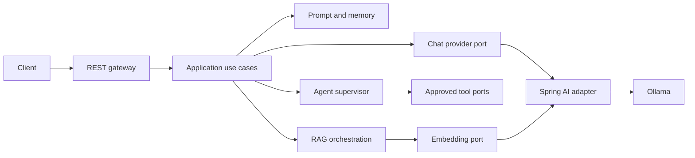

# AI Foundry

AI Foundry is a Java 25, Spring Boot 3.5, Spring AI, and Ollama baseline for provider-neutral chat, retrieval-augmented generation (RAG), and a safe multi-agent banking assistant. It follows hexagonal architecture so provider, persistence, and tool adapters can be replaced without changing the domain.

> Banking data and tools in this repository are simulated. Do not use them for real accounts or financial decisions.

## Architecture



## Modules

| Module | Responsibility |
|---|---|
| `platform-bom` | Central dependency versions |
| `platform-common` | Errors, validation, correlation IDs, web concerns |
| `ai-domain` | Framework-free chat, embedding, RAG, and agent models |
| `ai-provider-spi` | Provider-neutral chat, streaming, embedding, and health ports |
| `ai-application` | Chat, prompt, memory, RAG, tool, and agent orchestration |
| `ai-provider-spring-ai` | Spring AI/Ollama adapters |
| `ai-gateway-service` | Executable REST API, security, configuration, and actuator |

## Prerequisites

- JDK 25 (`java -version` must report 25)
- Maven 3.9+
- Ollama, or Docker with Compose

Install Ollama, start it, and pull the models:

```bash
ollama serve
./scripts/pull-models.sh
```

Override defaults with `OLLAMA_BASE_URL`, `OLLAMA_CHAT_MODEL`, and `OLLAMA_EMBEDDING_MODEL`.

## Build, test, and run

```bash
mvn clean verify
mvn -pl ai-gateway-service -am spring-boot:run
```

Java sources follow Google Java Style and are checked automatically during Maven's
`validate` phase. Apply or check formatting explicitly with:

```bash
mvn -pl '!platform-bom' spotless:apply
mvn -pl '!platform-bom' spotless:check
```

The standalone `platform-bom` module contains no Java source. Repository-wide editor
defaults for Java, XML, YAML, JSON, Markdown, and shell files are defined in
`.editorconfig`.

Validate YAML syntax, formatting, Compose configuration, and both Kubernetes overlays:

```bash
./scripts/lint-yaml.sh
```

`mvn clean verify` also generates JaCoCo reports for source-bearing modules and enforces
at least 90% line coverage across the corrected prompt, chunking, and approval core.
GitHub Actions runs the same formatting, YAML, test, and coverage checks for pushes and
pull requests.

The API runs at `http://localhost:8080`; health is at `/actuator/health`. To run the container stack:

```bash
docker compose -f docker/docker-compose.yml up --build
```

## API examples

```bash
curl -X POST http://localhost:8080/api/v1/chat/completions \
  -H 'Content-Type: application/json' \
  -H 'X-Correlation-Id: demo-001' \
  -d '{"conversationId":"demo-1","message":"Explain overdraft protection","useRag":false}'

curl http://localhost:8080/api/v1/providers/health
curl http://localhost:8080/api/v1/models
curl -X DELETE http://localhost:8080/api/v1/chat/conversations/demo-1

curl -X POST http://localhost:8080/api/v1/knowledge/documents \
  -H 'Content-Type: application/json' \
  -d '{"documentId":"overdraft-policy","title":"Overdraft Policy","content":"Overdraft protection details...","source":"internal-policy","contentType":"text/plain"}'

curl -X POST http://localhost:8080/api/v1/knowledge/search \
  -H 'Content-Type: application/json' \
  -d '{"query":"overdraft protection","topK":5,"minimumScore":0.0}'

curl -X POST http://localhost:8080/api/v1/agents/execute \
  -H 'Content-Type: application/json' \
  -d '{"conversationId":"agent-demo","userId":"user-123","message":"I see an unauthorized payment"}'
```

Streaming uses Server-Sent Events at `POST /api/v1/chat/stream` with the same request shape.

## Security profiles

- `local` (default) permits API calls for development.
- `test` is used by automated tests.
- `secure` enables JWT resource-server validation. Set `JWT_ISSUER_URI`; approval routes require `APPROVER`, and document administration requires `AI_ADMIN`.

Never expose the local profile to an untrusted network.

## Deployment

- `docker/` contains the non-root multi-stage image and local Compose stack.
- `k8s/base/` contains probes, resources, security context, autoscaling, disruption, ingress, and network policies.
- `k8s/overlays/local` and `k8s/overlays/dev` are Kustomize overlays.

Apply an overlay with `kubectl apply -k k8s/overlays/local`. Replace the example secret and image before deploying.

## Days 1–6 scope

1. Multi-module foundation, domain, common errors, and correlation IDs.
2. Provider SPI, prompt rendering/validation, chat contracts, and memory.
3. Spring AI/Ollama chat, embedding, streaming, model, and provider APIs.
4. Deterministic chunking and an in-memory cosine vector store for RAG.
5. Security profiles, actuator/Prometheus, Docker, Kubernetes, and scripts.
6. Framework-free agent definitions, deterministic banking intent routing, registry, and prompt safety rules.

The in-memory stores are intentionally local baselines: state is lost on restart and is not shared between replicas. MCP defaults to a controlled no-op gateway. All specialist agents retrieve knowledge context and select allow-listed tools with deterministic rules. Banking tools and their results are simulated; approval-gated requests are stored and resume from the approval ID only after an explicit decision.

Additional endpoints include `GET /api/v1/agents`, `GET /api/v1/tools`, `POST /api/v1/tools/execute`, document get/delete operations, and approval get/approve/reject operations under `/api/v1/approvals`.

## Troubleshooting

- `Connection refused` to port 11434: start `ollama serve` or set `OLLAMA_BASE_URL`.
- Model-not-found errors: run `./scripts/pull-models.sh`.
- Maven rejects Java: make `JAVA_HOME` point to a JDK 25 installation.
- First build is slow: Maven and Ollama must download dependencies/models.
- Container health fails during model startup: inspect `docker compose -f docker/docker-compose.yml logs`.

The detailed implementation brief is in [AI_Foundry_Days_1_to_6_Class_Implementation_Guide.md](AI_Foundry_Days_1_to_6_Class_Implementation_Guide.md).

Implemented request sequences, agent routing, RAG flows, tool approvals, and capability boundaries are documented in [docs/SEQUENCE_AND_WORKFLOWS.md](docs/SEQUENCE_AND_WORKFLOWS.md).

The project structure, runtime topology, deployment model, configuration, extension points, and operational architecture are documented in [docs/ARCHITECTURE.md](docs/ARCHITECTURE.md). Registered agents, routing policy, tool permissions, approval flow, and safety boundaries are documented in [docs/AGENTS.md](docs/AGENTS.md).
