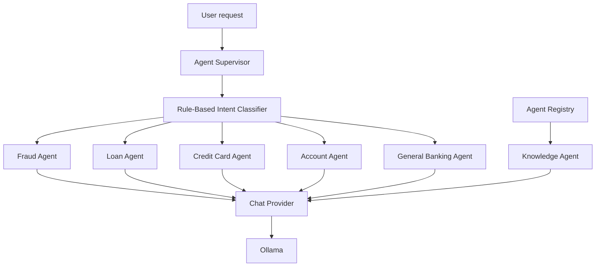
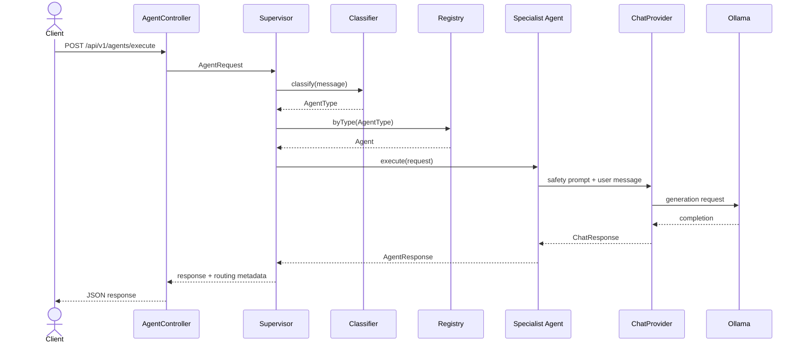
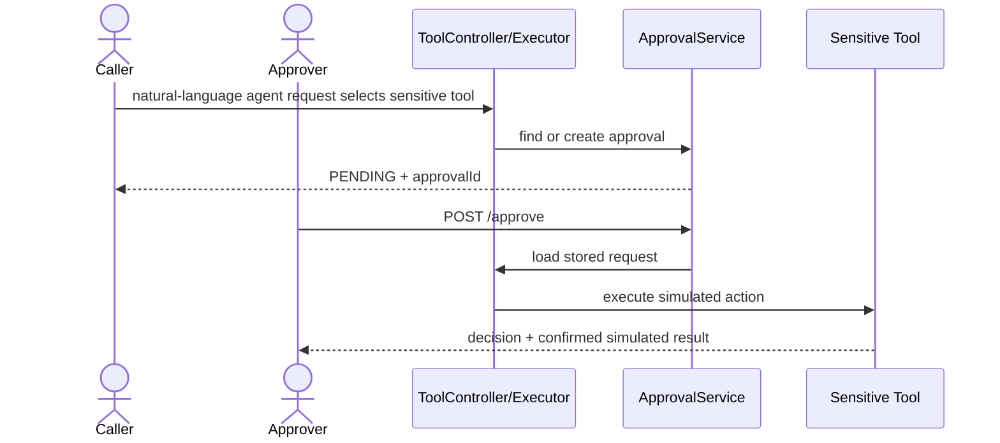

# AI Foundry Agents

This document describes the agents that are registered in the running system, how requests are routed, what each agent is allowed to claim, and how tools and approvals relate to agent behavior.

## 1. Agent system overview



The agent API is:

```text
GET  /api/v1/agents
POST /api/v1/agents/execute
```

`GET` returns registered agent definitions. `POST` creates an execution ID, classifies the message, selects an agent, invokes the provider, and returns selection metadata.

## 2. Supervisor behavior

The supervisor performs these steps:

1. Generate an execution ID when one is absent.
2. Classify the user message using deterministic, case-insensitive keywords.
3. Find a registered specialist matching the classified type.
4. Fall back to the general banking agent when no matching specialist exists.
5. Execute the selected agent.
6. Add `classifiedIntent` and `selectedAgent` metadata to the response.
7. Return a controlled failure response if no agent is available or provider execution fails.

The supervisor does not use an LLM for routing, so routing is repeatable and testable.

## 3. Routing rules

Rules are evaluated in this order:

| Priority | Keywords | Type | Selected agent |
|---:|---|---|---|
| 1 | `fraud`, `stolen`, `suspicious`, `unauthorized` | `FRAUD` | `fraud-agent` |
| 2 | `loan`, `mortgage`, `emi`, `interest`, `eligibility` | `LOAN` | `loan-agent` |
| 3 | `card`, `credit card`, `limit`, `statement` | `CREDIT_CARD` | `credit-card-agent` |
| 4 | `balance`, `account`, `transaction`, `debit` | `ACCOUNT` | `account-agent` |
| Fallback | everything else | `GENERAL_BANKING` | `general-banking-agent` |

Because fraud rules are evaluated first, a request such as “unauthorized card transaction” routes to the fraud agent rather than the credit-card or account agent.

The knowledge agent is registered but has no current classifier rule. It can be discovered through `GET /api/v1/agents`, but the supervisor does not select it automatically.

## 4. Registered agents

### General Banking Agent

| Property | Value |
|---|---|
| Agent ID | `general-banking-agent` |
| Type | `GENERAL_BANKING` |
| Tools | None |
| Approval | Not required |

Responsibilities:

- answer general banking questions;
- avoid inventing facts;
- avoid claiming that an external action occurred;
- act as the supervisor fallback.

### Fraud Agent

| Property | Value |
|---|---|
| Agent ID | `fraud-agent` |
| Type | `FRAUD` |
| Declared tools | `transaction-lookup`, `freeze-card` |
| Sensitive action | `freeze-card` requires approval |

Responsibilities:

- prioritize customer safety;
- handle suspicious, stolen, fraudulent, or unauthorized activity questions;
- never claim a card was frozen without a confirmed successful tool result;
- never expose a raw card/account identifier.

### Loan Agent

| Property | Value |
|---|---|
| Agent ID | `loan-agent` |
| Type | `LOAN` |
| Declared tool | `loan-eligibility-check` |
| Approval | Not required |

Responsibilities:

- provide loan and eligibility guidance;
- label calculations as illustrative;
- never present an estimate as a final underwriting decision.

### Credit Card Agent

| Property | Value |
|---|---|
| Agent ID | `credit-card-agent` |
| Type | `CREDIT_CARD` |
| Declared tools | `card-details`, `card-replacement-request` |
| Sensitive action | replacement requires approval |

Responsibilities:

- help with limits, statements, status, benefits, and replacement questions;
- mask card identifiers;
- never claim replacement succeeded without a successful tool result.

### Account Agent

| Property | Value |
|---|---|
| Agent ID | `account-agent` |
| Type | `ACCOUNT` |
| Declared tools | `account-summary`, `transaction-lookup` |
| Approval | Not required |

Responsibilities:

- answer account balance and transaction questions;
- mask account identifiers;
- never initiate or claim a financial transaction.

### Knowledge Agent

| Property | Value |
|---|---|
| Agent ID | `knowledge-agent` |
| Type | `KNOWLEDGE` |
| Tools | None |
| Approval | Not required |

Responsibilities:

- answer from supplied enterprise knowledge;
- cite evidence when context exists;
- state when context is insufficient;
- avoid operational actions.

Current boundary: the registered agent calls the chat provider but is not automatically supplied with `RetrievalService` results.

## 5. Agent execution sequence



Example:

```bash
curl -X POST http://localhost:8080/api/v1/agents/execute \
  -H 'Content-Type: application/json' \
  -d '{
    "conversationId": "agent-demo",
    "userId": "user-123",
    "message": "I see an unauthorized transaction"
  }'
```

The response identifies the selected agent and classified intent in metadata.

## 6. Agents and tools

Agent definitions advertise allowed tools. `AgentSupervisor` routes to a specialist. The selected
agent prepares retrieval context and its prompt, then executes any requested tool through
`ToolExecutionService` before the final provider call.

```text
POST /api/v1/tools/execute
```

This separation means:

- an agent response is advisory unless a separate tool result confirms an action;
- no LLM response can directly freeze a card or create a replacement request;
- callers must provide the requested tool in `allowedTools`;
- the executor rejects unregistered or non-allowed tools;
- approval-gated tools remain blocked until approval.

### Agent-to-tool policy map

| Agent | Allowed tools by definition |
|---|---|
| General banking | None |
| Fraud | `transaction-lookup`, `freeze-card` |
| Loan | `loan-eligibility-check` |
| Credit card | `card-details`, `card-replacement-request` |
| Account | `account-summary`, `transaction-lookup` |
| Knowledge | None |

## 7. Approval-gated actions

Two tools require approval:

- `freeze-card`;
- `card-replacement-request`.



Example first request:

```bash
curl -X POST http://localhost:8080/api/v1/agents/execute \
  -H 'Content-Type: application/json' \
  -d '{
    "conversationId": "card-help",
    "userId": "user-123",
    "message": "Freeze my card",
    "context": {"cardId": "4111111111111111"}
  }'
```

Approve the returned ID:

```bash
curl -X POST http://localhost:8080/api/v1/approvals/APPROVAL_ID/approve \
  -H 'Content-Type: application/json'
```

The approval response contains both the terminal decision and the completed tool result. No
tool name, arguments, or approval context must be resent.

Approval requests expire after 15 minutes. Approved, rejected, and expired decisions are terminal.

## 8. Safety and data handling

The implemented safety boundaries are:

- banking tools are simulations and have no real banking integrations;
- account and card values are normalized and returned only as `****` plus the final four characters;
- full account/card identifiers are not returned in API tool results;
- sensitive tools require approval;
- tool failures return controlled messages rather than raw exceptions;
- agent provider failures return a safe failure response;
- specialist prompts prohibit unsupported operational claims;
- loan calculations include a non-underwriting disclaimer.

Do not interpret an agent message as proof that an operational action occurred. Only a successful tool result confirms a simulated action.

## 9. Agent response model

An agent response contains:

- `executionId` — unique execution identifier;
- `agentId` — selected agent;
- `content` — generated response or controlled failure message;
- `status` — `COMPLETED`, `FAILED`, `APPROVAL_REQUIRED`, or `PARTIAL` domain status;
- `actions` — reserved list of agent actions;
- `metadata` — selected agent type and supervisor routing information.

When a rule selects a tool, `actions` contains the uniquely identified tool request and its status.

## 10. Adding an agent

To extend the system:

1. Add an `AgentType` when a new routing category is required.
2. Implement `Agent` or extend `AbstractBankingAgent`.
3. Define a stable agent ID, safety prompt, and allowed-tool set.
4. Register the agent in `ApplicationConfiguration`.
5. Extend `RuleBasedIntentClassifier` or replace it with another `IntentClassifier`.
6. Add prompt resources when the role needs a dedicated external prompt.
7. Add routing, safety, failure, and tool-authorization tests.
8. Update this document and `SEQUENCE_AND_WORKFLOWS.md`.

New agents must not bypass `ToolExecutionService` or `ApprovalService` for sensitive actions.

## 11. Current limitations

- Retrieval is in-memory and enabled for every specialist.
- Tool selection is deterministic and rule-based; autonomous multi-step planning is outside the
  current scope.
- Intent classification is deterministic keyword matching rather than model-based classification.
- Agent action history covers requested tool operations; ordinary advisory responses have no actions.
- Registry and approval state are in-memory and not shared across replicas.
- Tools are simulated; there is no real bank connection.
- `allowedTools` is supplied by the tool API caller rather than derived from a server-side agent execution session.

These boundaries should be considered when designing a UI, workflow engine, or production authorization layer around the agent APIs.
