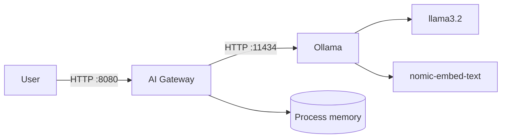
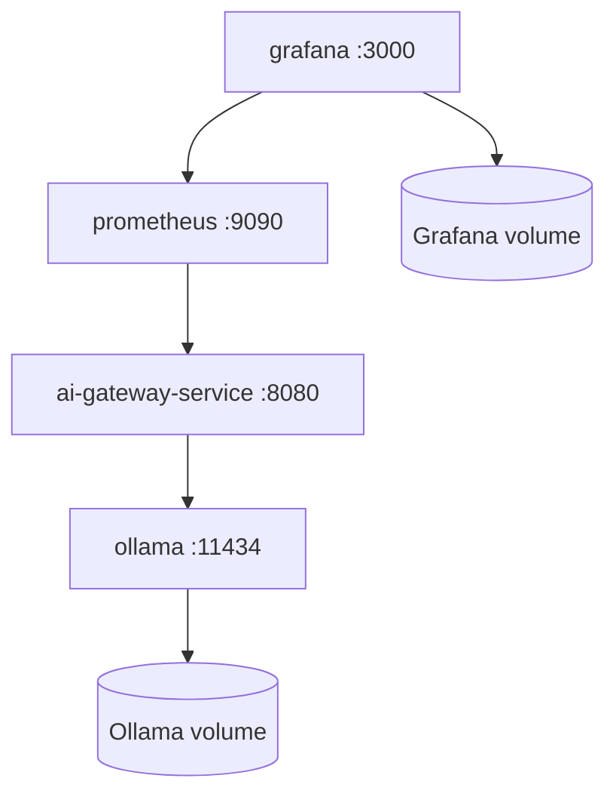
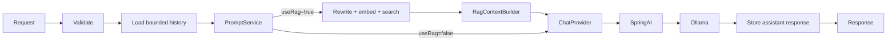
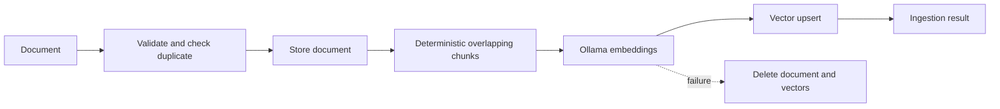
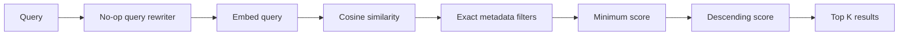
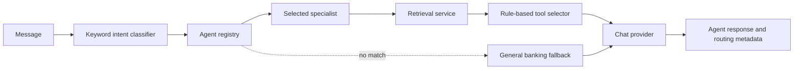
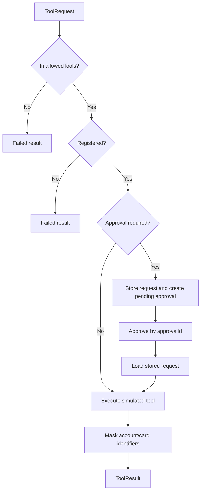

# AI Foundry Architecture

This is the running architecture document for AI Foundry. It explains the structure that exists in the repository, how requests move through it, how to run it, and where the current implementation can be extended.

For detailed request-by-request sequence diagrams, see [SEQUENCE_AND_WORKFLOWS.md](SEQUENCE_AND_WORKFLOWS.md). Agent-specific behavior is documented in [AGENTS.md](AGENTS.md).

## 1. System purpose

AI Foundry is a Java 25 and Spring Boot platform for:

- synchronous and streaming LLM chat;
- conversation memory;
- document ingestion and semantic retrieval;
- rule-routed banking specialist agents;
- allow-listed, simulated banking tools;
- human approval for sensitive actions;
- provider-neutral integration with Ollama through Spring AI;
- operational health, metrics, Docker, and Kubernetes deployment.

The system uses hexagonal architecture. Core domain and application behavior depend on ports, while Spring AI, HTTP, and in-memory storage live at the outside of the system.

## 2. Logical architecture

```mermaid
flowchart LR
    Client[API client] --> Gateway[ai-gateway-service]

    subgraph GatewayLayer[Inbound adapters]
        Controllers[REST controllers]
        Security[Security and correlation filters]
    end

    subgraph ApplicationLayer[Application core]
        Chat[Chat service]
        Memory[Conversation memory service]
        Prompt[Prompt pipeline]
        RAG[RAG ingestion and retrieval]
        Supervisor[Agent supervisor]
        Tools[Tool execution and approvals]
    end

    subgraph Ports[Provider ports]
        ChatPort[ChatProvider]
        EmbedPort[EmbeddingProvider]
        HealthPort[Provider health]
    end

    subgraph Adapters[Outbound adapters]
        SpringAI[Spring AI adapter]
        InMemory[In-memory repositories]
        MCP[No-op MCP gateway]
    end

    Gateway --> GatewayLayer
    GatewayLayer --> ApplicationLayer
    ApplicationLayer --> Ports
    ApplicationLayer --> InMemory
    ApplicationLayer --> MCP
    Ports --> SpringAI
    SpringAI --> Ollama[Ollama]
```



The dependency direction is inward:

```text
gateway → application → provider SPI/domain
                      ↘ platform common

Spring AI adapter → provider SPI/domain/platform common
```

The domain does not import Spring. The provider SPI does not expose Spring AI types. Controllers call application services rather than provider adapters directly. ArchUnit tests enforce these boundaries.

## 3. Maven modules

### `platform-bom`

Central dependency management for Spring Boot, Spring AI, JUnit, and shared dependency versions.

### `platform-common`

Cross-cutting infrastructure:

- stable error codes and platform exceptions;
- standard `ApiError` responses;
- correlation ID filter and MDC integration;
- input sanitization and validation results;
- global exception translation.

It contains no AI orchestration.

### `ai-domain`

Framework-free domain models for:

- chat messages, requests, responses, options, token usage, and finish reasons;
- embeddings;
- documents, chunks, vectors, retrieval queries, and results;
- agents, actions, definitions, execution status, and agent types.

These models are provider-neutral and transport-neutral.

### `ai-provider-spi`

Outbound interfaces for:

- synchronous and streaming chat;
- embeddings;
- provider health;
- supported model discovery.

An application service depends on these interfaces, not on Ollama or Spring AI.

### `ai-application`

Use cases and orchestration:

- chat validation and bounded conversation memory;
- deterministic prompt building and validation;
- document ingestion, chunking, embedding, and vector persistence;
- semantic retrieval using cosine similarity;
- rule-based agent intent classification and specialist execution;
- tool registry, allow-list enforcement, simulated banking tools, and approvals;
- MCP extension interface and disabled default adapter;
- Micrometer metric implementations.

### `ai-provider-spring-ai`

The Ollama provider adapter:

- maps internal chat requests to Spring AI `ChatClient` calls;
- maps streaming content to internal response chunks;
- maps embedding requests to `EmbeddingModel` calls;
- translates provider failures into controlled platform errors;
- reports provider name, supported models, and health.

Spring AI types remain inside this module.

### `ai-gateway-service`

The executable Spring Boot service:

- REST controllers and request/response contracts;
- local and secure security profiles;
- application bean wiring;
- bounded async executor;
- CORS configuration;
- observability configuration;
- Actuator and Prometheus endpoints;
- application configuration and prompt resources.

## 4. Runtime topology

### Local process topology



The gateway owns in-memory conversation, document, vector, approval, agent, and tool state. Restarting it clears that state. Ollama model data persists independently.

### Docker Compose topology



### Kubernetes topology

The base deployment provides:

- two gateway replicas;
- rolling updates;
- startup, readiness, and liveness probes;
- resource requests and limits;
- non-root execution and dropped Linux capabilities;
- read-only root filesystem;
- topology spreading;
- a PodDisruptionBudget;
- a HorizontalPodAutoscaler;
- ConfigMap and Secret injection;
- Service, Ingress, ServiceAccount, and NetworkPolicy resources;
- `local` and `dev` Kustomize overlays.

Because state is currently in-memory, documents, vectors, approvals, and conversations are not shared between Kubernetes replicas. A production distributed deployment should replace the persistence ports with shared stores or use session affinity as a temporary measure.

## 5. Core workflows

### Chat workflow



Both synchronous and streaming paths store user and assistant messages. The streaming path
assembles SSE deltas and persists the completed assistant response when the publisher finishes.

The chat request includes `useRag`. `DefaultChatService` delegates all prompt creation to
`PromptService`; enabled RAG performs rewrite, embedding, vector search, bounded context
construction, and resource-template rendering before invoking the provider.

### RAG ingestion workflow



Chunk IDs are deterministic within a document. Metadata includes source and title. Overwrite removes old vectors before inserting the replacement document.

### Retrieval workflow



The query rewriter is intentionally replaceable. The current implementation returns the original query.

### Agent workflow



`AgentSupervisor` classifies the intent and selects one specialist. Specialists use resource-backed
prompts, retrieval, rule-based tool selection, and `ToolExecutionService`. If a protected tool is selected, the
workflow returns `APPROVAL_REQUIRED` before provider invocation and resumes only with an approved
decision.

### Tool and approval workflow



Approval requests expire after 15 minutes. Approve/reject decisions are terminal. Approval loads
and executes the stored request, so the client sends only the `approvalId` in the approval URL.

## 6. HTTP architecture

| Area | Base path | Operations |
|---|---|---|
| Chat | `/api/v1/chat` | completion, SSE stream, clear conversation |
| Knowledge | `/api/v1/knowledge` | ingest, get, delete, semantic search |
| Agents | `/api/v1/agents` | list definitions, execute supervisor workflow |
| Tools | `/api/v1/tools` | list definitions, execute allow-listed tool |
| Approvals | `/api/v1/approvals` | inspect, approve, reject |
| Providers | `/api/v1/providers` | provider metadata and health |
| Models | `/api/v1/models` | supported chat and embedding models |
| Operations | `/actuator` | health, info, metrics, Prometheus |

All API responses receive `X-Correlation-Id`. Validation and platform failures use stable error codes rather than Java exception names.

## 7. Security architecture

Two profiles are implemented:

- `local` and `test` permit requests for development and automated testing.
- `secure` validates JWT bearer tokens.

Under the secure profile:

- actuator health is public;
- approval endpoints require `ROLE_APPROVER`;
- knowledge-document endpoints require `ROLE_AI_ADMIN`;
- other API endpoints require authentication.

`JWT_ISSUER_URI` configures the resource server issuer. The local profile must not be exposed to untrusted networks.

## 8. Data and state ownership

| State | Current owner | Lifetime | Replacement point |
|---|---|---|---|
| Conversation messages | In-memory bounded deque | Gateway process | `ConversationMemoryPort` |
| Knowledge documents | Concurrent in-memory map | Gateway process | `DocumentRepositoryPort` |
| Chunk vectors | Concurrent in-memory vector store | Gateway process | Vector-store interface |
| Approval requests/decisions | Concurrent in-memory maps | Gateway process | Approval service boundary |
| Agents and tools | In-memory registries | Gateway process | Registry/configuration wiring |
| Ollama models | Ollama volume/filesystem | Ollama installation | Provider adapter/configuration |

No database dependency is required for the Days 1–6 implementation.

## 9. Observability

The architecture provides:

- correlation IDs in request/response headers and logging MDC;
- Actuator health, info, metrics, and Prometheus endpoints;
- chat request/error counters and latency timers;
- RAG ingestion/retrieval metrics;
- agent and tool execution metrics;
- readiness and liveness health groups for Kubernetes.

Provider responses expose safe metadata only. Internal base URLs and credentials are not returned by provider APIs.

## 10. Running the architecture

### Prerequisites

```bash
java -version       # Java 25
mvn -version        # Maven 3.9+
ollama --version
```

### Prepare Ollama

```bash
ollama serve
ollama pull llama3.2
ollama pull nomic-embed-text
```

### Build and test

```bash
mvn clean verify
```

### Run the gateway

```bash
mvn -pl ai-gateway-service -am spring-boot:run
```

Or run the packaged artifact:

```bash
java -jar ai-gateway-service/target/ai-gateway-service-1.0.0-SNAPSHOT.jar
```

### Validate the running system

```bash
./scripts/smoke-test.sh
curl http://localhost:8080/api/v1/providers/health
curl http://localhost:8080/api/v1/agents
curl http://localhost:8080/api/v1/tools
```

### Run with Docker

```bash
docker compose -f docker/docker-compose.yml up --build
```

### Render or apply Kubernetes

```bash
kubectl kustomize k8s/overlays/local
kubectl apply -k k8s/overlays/local
```

Replace the example image and secret values before deploying outside local development.

## 11. Configuration

Key environment variables:

| Variable | Default | Purpose |
|---|---|---|
| `OLLAMA_BASE_URL` | `http://localhost:11434` | Ollama API location |
| `OLLAMA_CHAT_MODEL` | `llama3.2` | Chat model |
| `OLLAMA_EMBEDDING_MODEL` | `nomic-embed-text` | Embedding model |
| `JWT_ISSUER_URI` | none | Secure-profile JWT issuer |

Important application defaults:

- prompt limit: 50,000 characters;
- conversation limit: 30 messages;
- RAG chunk size: 1,000 characters;
- chunk overlap: 150 characters;
- minimum chunk length: 100 characters;
- maximum context size: 12,000 characters;
- provider timeout: 60 seconds.

## 12. Extension architecture

The main supported extension points are:

- implement `ChatProvider` or `EmbeddingProvider` for another AI provider;
- replace in-memory memory/document/vector ports with persistent adapters;
- replace the no-op query rewriter with an LLM or rules implementation;
- add an MCP gateway without changing domain types;
- register new agents and tools through application configuration;
- extend agent planning through `ToolExecutionService` while preserving allow lists and approvals;
- externalize prompt templates to a database or configuration service.

## 13. Architectural limitations

- In-memory state is not durable or shared across replicas.
- Retrieval uses process-local vectors and a pass-through query rewriter by default.
- Specialist agents use deterministic single-tool selection; autonomous multi-step planning is not implemented.
- Intent classification uses deterministic keyword rules.
- Streaming assistant responses are persisted only after the publisher completes successfully.
- Tool outputs and banking actions are simulations only.
- The caller-provided `allowedTools` field is an application guard, not a replacement for server-derived authorization in a public production API.

These are explicit boundaries of the current code, not hidden capabilities.

## 14. Keeping this document current

Update this file whenever any of the following changes:

- a module or dependency direction changes;
- a controller endpoint is added or removed;
- state moves from memory to an external store;
- an agent begins invoking RAG or tools automatically;
- security roles or profiles change;
- provider, model, Docker, or Kubernetes topology changes.

Corresponding detailed sequences should be updated in `SEQUENCE_AND_WORKFLOWS.md`.
