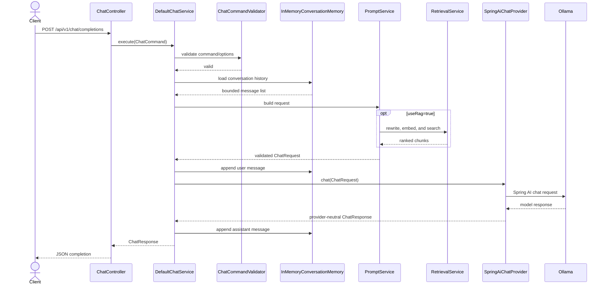
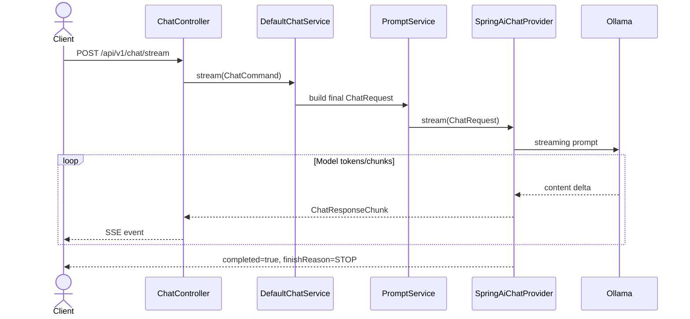
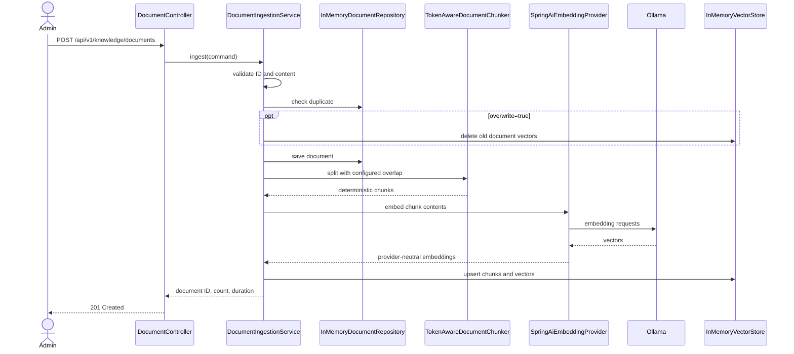
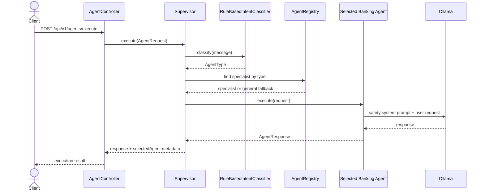
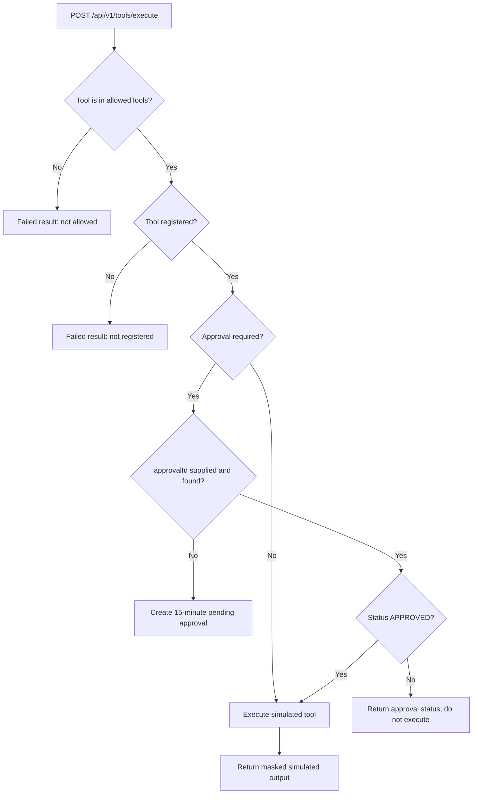
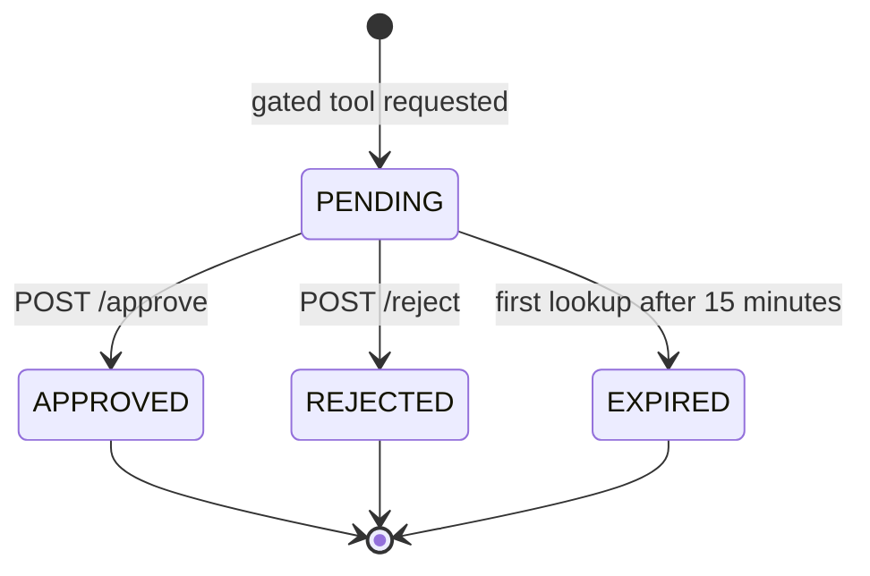
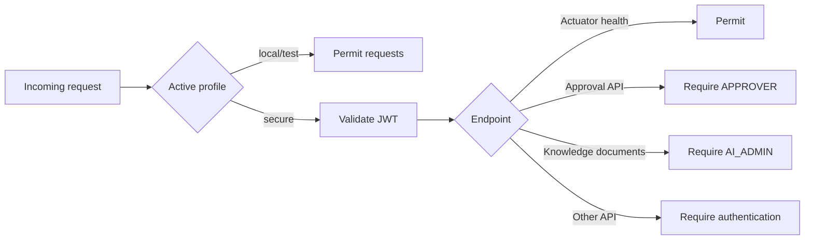

# AI Foundry: Implemented Sequences and Workflows

This document describes the capabilities that currently exist in the code. It distinguishes working behavior from extension points so consumers do not assume that an agent, tool, or RAG operation happens automatically when it does not.

## Capability map

| Capability | Entry point | Implementation | Runtime dependency |
|---|---|---|---|
| Synchronous AI chat | `POST /api/v1/chat/completions` | Conversation validation, bounded memory, Spring AI adapter | Ollama chat model |
| Streaming AI chat | `POST /api/v1/chat/stream` | Server-Sent Events containing response chunks | Ollama chat model |
| Clear conversation | `DELETE /api/v1/chat/conversations/{id}` | Removes the in-memory conversation | None |
| Ingest knowledge | `POST /api/v1/knowledge/documents` | Document storage, chunking, embedding, vector upsert | Ollama embedding model |
| Read/delete knowledge | `GET/DELETE /api/v1/knowledge/documents/{id}` | In-memory document and vector deletion | None |
| Semantic search | `POST /api/v1/knowledge/search` | Query embedding, cosine search, filters, top-K selection | Ollama embedding model |
| List/execute agents | `GET /api/v1/agents`, `POST /api/v1/agents/execute` | Rule-based intent routing and specialist LLM response | Ollama chat model |
| List/execute tools | `GET /api/v1/tools`, `POST /api/v1/tools/execute` | Allow-list validation, approval gate, simulated result | None |
| Approval decisions | `/api/v1/approvals/{id}` | In-memory pending, approved, rejected, and expired decisions | None |
| Provider/model discovery | `/api/v1/providers`, `/api/v1/models` | Safe provider/model metadata | None |
| Operations | `/actuator/health`, `/actuator/prometheus`, `/actuator/metrics` | Spring Boot Actuator and Micrometer | None |

## 1. Synchronous chat



Behavior:

- A missing conversation ID is replaced with a UUID.
- Memory retains at most 30 messages by default and evicts the oldest messages.
- Temperature must be between 0 and 2, `topP` between 0 and 1, and `maxTokens` positive.
- `X-Correlation-Id` is accepted or generated and returned in the response.
- When chat `useRag=true`, `PromptService` rewrites the query, creates an embedding, searches the
  vector store, builds bounded context, and renders `rag-banking.txt`. RAG-enabled specialists
  retain their own resource prompt and inject the same bounded context. When false, all retrieval
  work is skipped.

## 2. Streaming chat



The user message is stored before streaming. The application assembles response deltas and
appends the completed assistant response to conversation memory when the stream completes.

## 3. Knowledge ingestion



Failure behavior:

- Duplicate IDs are rejected unless `overwrite` is true.
- An embedding or vector failure removes the newly stored document and vectors.
- Documents and vectors are memory-resident and disappear when the process restarts.

## 4. Semantic knowledge search

```mermaid
flowchart LR
    A[Search request] --> B[Validate query]
    B --> C[No-op query rewriter]
    C --> D[Embed query with Ollama]
    D --> E[Cosine similarity search]
    E --> F[Apply metadata filters]
    F --> G[Apply minimum score]
    G --> H[Sort descending]
    H --> I[Return top K chunks]
```



Search request controls are `query`, `topK`, `minimumScore`, and exact-match metadata `filters`. Results contain chunk/document IDs, content, score, and metadata.

## 5. Agent supervision



### Routing rules

| Message contains | Selected type | Agent ID |
|---|---|---|
| `fraud`, `stolen`, `suspicious`, `unauthorized` | Fraud | `fraud-agent` |
| `loan`, `mortgage`, `emi`, `interest`, `eligibility` | Loan | `loan-agent` |
| `card`, `credit card`, `limit`, `statement` | Credit card | `credit-card-agent` |
| `balance`, `account`, `transaction`, `debit` | Account | `account-agent` |
| Anything else | General banking | `general-banking-agent` |

The `knowledge-agent` is registered and discoverable but is not selected by the current keyword classifier.

Important boundary: agents advertise allowed tools and use specialist safety prompts, but agent execution does not automatically infer or invoke a tool. Tools are invoked through `/api/v1/tools/execute`.

## 6. Tool execution and approval



### Implemented tools

| Tool | Required inputs | Approval | Result |
|---|---|---:|---|
| `transaction-lookup` | `accountId` | No | Masked account and simulated posted transaction |
| `account-summary` | `accountId` | No | Masked account and simulated balances |
| `card-details` | `cardId` | No | Masked card, status, limit, and expiry |
| `freeze-card` | `cardId` | Yes | Simulated frozen status and action ID |
| `card-replacement-request` | `cardId` | Yes | Simulated replacement request ID |
| `loan-eligibility-check` | `monthlyIncome`, `monthlyDebt`, `requestedAmount` | No | Illustrative estimate and underwriting disclaimer |

The caller currently supplies `allowedTools` to the tool endpoint. This is an application contract, not a substitute for authorization at an external API boundary. All outputs are simulated and no real banking system is contacted.

### Approval lifecycle



To execute an approved action, repeat the tool request with the returned `approvalId` in `context`. Decisions cannot be changed after leaving `PENDING`.

## 7. Security workflow



The default profile is `local`. Do not expose it to an untrusted network. The secure profile requires `JWT_ISSUER_URI`.

## 8. Error and correlation workflow

Every servlet request passes through `CorrelationIdFilter`. Platform exceptions become stable `ApiError` responses. Validation errors return 400, provider timeouts 504, provider availability errors 503, missing/failed RAG operations use controlled platform codes, and unknown errors return 500 without exposing a stack trace to the client.

## 9. Runtime and persistence boundaries

- Chat and embeddings use live Ollama through Spring AI.
- `llama3.2` is the default chat model.
- `nomic-embed-text` is the default embedding model and is needed for live ingestion/search.
- Conversation memory, documents, vectors, approvals, agent registry, and tool registry are in-memory.
- Multiple gateway replicas do not share in-memory state.
- MCP is an extension point; the configured `NoOpMcpToolGateway` discovers no tools and returns a controlled disabled result.
- Banking tools never connect to real banking systems.

## 10. Quick capability checks

```bash
# Health
curl http://localhost:8080/actuator/health

# Discover agents and tools
curl http://localhost:8080/api/v1/agents
curl http://localhost:8080/api/v1/tools

# General chat
curl -X POST http://localhost:8080/api/v1/chat/completions \
  -H 'Content-Type: application/json' \
  -d '{"conversationId":"demo","message":"Explain overdraft protection"}'

# Agent routing
curl -X POST http://localhost:8080/api/v1/agents/execute \
  -H 'Content-Type: application/json' \
  -d '{"userId":"user-1","message":"I see an unauthorized transaction"}'

# Simulated account tool
curl -X POST http://localhost:8080/api/v1/tools/execute \
  -H 'Content-Type: application/json' \
  -d '{"toolName":"account-summary","allowedTools":["account-summary"],"arguments":{"accountId":"123456789"}}'
```

For setup, build, deployment, and additional request examples, see the root `README.md`.
